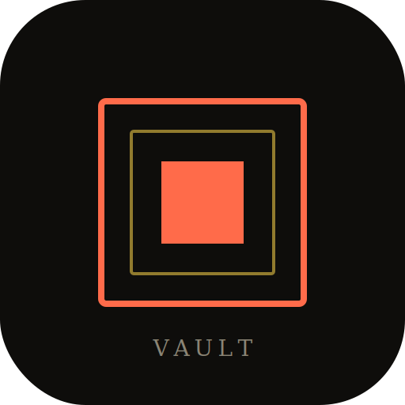

# Vault

A considered downloader for YouTube, Instagram, and TikTok. Paste a link, pick the moment, choose the format, archive it.



## What it does

- **Real metadata** — pulls actual title, author, duration, views, and thumbnail via `yt-dlp`
- **Real qualities** — only shows resolutions that actually exist (no fake 4K option if the video is 1080p)
- **Real storyboard** — video-mode trim timeline shows actual frames extracted via `ffmpeg` (one per second)
- **Real waveform** — audio-mode trim timeline shows the actual audio waveform, computed from the source's audio track
- **Real playback** — clicking play during trim preview produces real sound, synced to the playhead, bounded by IN/OUT marks
- **Real downloads** — files are actually downloaded via `yt-dlp` and trimmed via `ffmpeg`, then saved to your device

## Design

Editorial aesthetic — warm ink + cream + coral + amber palette, Fraunces serif headlines, Inter Tight body, JetBrains Mono micro-labels. Opaque surfaces (no glassmorphism), filmstrip details with sprocket holes, pro-editor timeline with ruler ticks and draggable handles. Built to look like a printed design publication, not an AI app.

## Stack

- **Frontend:** Next.js 16 + TypeScript + Tailwind CSS 4 + Framer Motion
- **Backend:** Next.js API routes + Python pipeline (`yt-dlp` + `ffmpeg` + `deno`)
- **State:** Zustand with persist middleware
- **Database:** Prisma + SQLite (download history)

## Quick start (local dev)

```bash
# 1. Install deps
npm install

# 2. Install Python pipeline deps (including PO Token provider for YouTube auth)
pip3 install --break-system-packages --pre "yt-dlp[default]" curl_cffi pycryptodomex bgutil-ytdlp-pot-provider

# 3. Install deno (required for YouTube nsig decoding)
curl -fsSL https://deno.land/install.sh | sh
sudo ln -sf ~/.deno/bin/deno /usr/local/bin/deno

# 4. Install ffmpeg
sudo apt install ffmpeg  # or: brew install ffmpeg

# 5. Run
npm run dev
```

Open `http://localhost:3000`.

## Deployment

See **[DEPLOY.md](DEPLOY.md)** for step-by-step instructions for Render (free), Fly.io (free), and Railway.

The TL;DR for Render:

1. Push this repo to GitHub
2. Connect it to Render as a Docker web service
3. Add env var: `VAULT_CACHE_DIR=/data/media`
4. Add a 1GB disk at `/data`
5. Deploy

## How YouTube auth works (no cookies)

Vault uses the [BgUtils PO Token provider](https://github.com/Brainicism/bgutil-ytdlp-pot-provider) — same approach as **Seal** and **cobalt.tools**. It generates Proof-of-Origin tokens automatically, bypassing YouTube's bot detection without cookies or user sign-in.

## Project structure

```
├── src/
│   ├── app/
│   │   ├── api/
│   │   │   ├── fetch-meta/       # yt-dlp metadata extraction
│   │   │   ├── download/          # yt-dlp + ffmpeg download + trim
│   │   │   ├── media/
│   │   │   │   ├── prepare/       # Generate storyboard + waveform + audio
│   │   │   │   └── file/          # Serve cached media files
│   │   │   └── history/           # Prisma history CRUD
│   │   ├── globals.css            # Editorial design system
│   │   ├── layout.tsx             # Fonts (Fraunces + Inter Tight + JetBrains Mono)
│   │   └── page.tsx
│   ├── components/snapvault/      # All UI components
│   └── lib/
│       ├── platform.ts            # URL detection + types
│       └── store.ts               # Zustand store
├── scripts/
│   └── source_pipeline.py         # Python wrapper for yt-dlp + ffmpeg
├── prisma/schema.prisma           # DownloadRecord model
├── Dockerfile                     # Node + Python + ffmpeg + yt-dlp + deno
├── render.yaml                    # One-click Render config
├── fly.toml                       # Fly.io config
└── DEPLOY.md                      # Step-by-step deployment guide
```

## License

MIT — do whatever you want.
